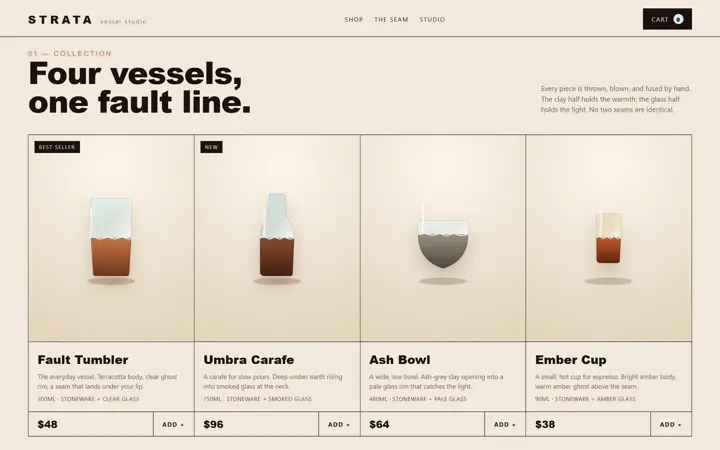

<div align="center">

# BuildFast Skills

Production-grade Agent Skills for turning plain-language briefs into finished web experiences.

One focused workflow. The real project. A verified handoff.

[Browse the collection](#choose-your-build) · [Install](#install) · [How it works](#the-buildfast-recipe)

<br>

<code>npx skills add buildfastwithai/buildfast-skills</code>

</div>


<p align="center"><sub>Commerce, landing pages, premium interfaces, realtime avatars, and browser games—one deliberate skill for each job.</sub></p>

---

## Why this exists

Most skill repositories are long lists of prompt snippets. BuildFast Skills is deliberately smaller and deeper: every package defines a concrete output, supplies the references or starter material needed to build it, and ends with real verification.

There is no framework to adopt and no hosted service to depend on. Pick the outcome, describe the brief, and let the skill work inside the project you already have.

## What you get

- **A complete method, not a magic sentence.** Each `SKILL.md` carries the workflow, decisions, boundaries, and finish line for one job.
- **Useful material in the box.** References, templates, test scaffolds, and executable audits live beside the instructions that use them.
- **Respect for the existing stack.** Skills preserve working behavior and avoid unrelated migrations.
- **Proof before handoff.** Builds, browser checks, audits, or playthroughs close the loop.
- **Honest limits.** Missing credentials, providers, assets, and production integrations are named—not simulated.

## Choose your build

| Skill | Start here when you need… | Finished means… |
|:--|:--|:--|
| **[Crazy Ecommerce Builder](skills/crazy-ecommerce-builder-skill/)** | A storefront with a memorable, product-specific creative thesis | Original visual system, responsive commerce UI, usable cart, and a passing production build |
| **[Landing Page Generator](skills/landing-page-generator-skill/)** | A focused campaign, launch, signup, or lead-capture page | One production-ready HTML file with conversion, CTA, and likely-speed audits |
| **[Premium UI Revamp](skills/premium-ui-revamp-skill/)** | A working interface that feels generic, dated, or visibly AI-generated | Implemented redesign that preserves behavior and survives build, access, and responsive checks |
| **[Talking Avatar](skills/talking-avatar-skill/)** | Realtime voice chat with an audio-driven character | Runnable app, safe session negotiation, mouth poses tied to remote audio, and regression tests |
| **[Three.js Game Generator](skills/threejs-game-generator-skill/)** | An original 3D browser game or an unfinished Three.js scene | A small complete game loop with controls, states, audio, persistence, and playthrough proof |

## See the range

| A real storefront built by the commerce skill | A premium-interface transformation direction | A real voice-avatar app built by the avatar skill |
|:--:|:--:|:--:|
|  |  |  |
| **Commerce proof** | **Revamp direction** | **Realtime proof** |

The storefront and avatar images are captured from real Build Fast with AI example apps. The interface transformation is an editorial direction visual, clearly separated from product proof.

## Install

Choose interactively:

```bash
npx skills add buildfastwithai/buildfast-skills
```

Install one skill directly:

```bash
npx skills add buildfastwithai/buildfast-skills --skill premium-ui-revamp-skill
```

Add `--global` to make it available across projects, then restart your agent and ask for the outcome in normal language.

> [!TIP]
> **A strong first prompt:** “Use premium-ui-revamp-skill to make this dashboard feel deliberate and trustworthy. Preserve every workflow and verify the result at desktop and mobile sizes.”

### Other assistants

Copy the complete `*-skill` folder into your assistant's skills directory. Keep the folder intact so `references/`, `scripts/`, and `assets/` remain available. If the assistant has no skill system, attach `SKILL.md` and the files it links to.

## What is inside

```text
buildfast-skills/
├── assets/
│   └── readme/
│       └── collection-hero.webp
├── skills/
│   ├── crazy-ecommerce-builder-skill/
│   ├── landing-page-generator-skill/
│   ├── premium-ui-revamp-skill/
│   ├── talking-avatar-skill/
│   └── threejs-game-generator-skill/
├── .gitignore
├── LICENSE
└── README.md
```

Each installable folder is self-contained:

```text
skill-name/
├── SKILL.md            # trigger, workflow, boundaries, verification
├── README.md           # human-facing tour and usage examples
├── agents/             # optional agent UI metadata
├── references/         # detail loaded only when relevant
├── scripts/            # repeatable checks or generators
└── assets/             # starter and README assets
```

## What these skills refuse to fake

- Production checkout, inventory, email, analytics, or hosting without the user's provider and credentials.
- Testimonials, customer logos, metrics, guarantees, or licensing claims that were never supplied.
- A “successful” UI revamp that breaks existing workflows.
- Lip sync driven by a decorative timer instead of the actual remote audio stream.
- A large game framework presented as if it were a finished playable game.

## Validate locally

This repository intentionally contains no deploy or CI setup. Confirm local discovery and executable helpers with:

```bash
npx skills add . --list
python -m compileall -q skills/landing-page-generator-skill/scripts
python -m compileall -q skills/talking-avatar-skill/scripts
```

## License

[MIT](LICENSE) © 2026 Build Fast with AI.

---

<p align="center">
  Built by <a href="https://www.buildfastwithai.com/"><strong>Build Fast with AI</strong></a>
  · <a href="https://github.com/buildfastwithai/buildfast-skills/issues/new">Request a skill</a>
  · <a href="https://github.com/buildfastwithai/buildfast-skills/stargazers">Star the collection</a>
</p>
